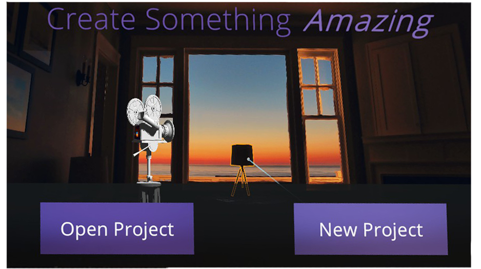

# Getting Started


## Creating a Project
To create a project, select the `New Project` option in the main menu (pictured below).  You can use the pointer on your right controller to point, and the right trigger to click.

Next, choose a name and for the project (below) using the VR keyboard now enabled.

Next, choose a location using the file browser.


When creating a project with Sceneforge, the software will automatically generate the required file structure in your specified directory. When opening a project, Sceneforge will check if the file structure is correct, and will fix/add any incorrect folders.

*It is important that you add any assets before opening the project. - See Known Issues.*

```
├─ Project Root Folder/
│  └─ 3D Models          --- Place all 3D Model files here.
│  └─ Audio              --- Place all audio files here.
│  └─ Image Output       --- This is where all taken photos are exported.
│  └─ Scenes             --- This is where all scenes are stored
│  └─ Scripts            --- This is where all scripts are stored.
│  └─ Storyboards        --- This is where all storyboards are exported.
│  └─ Textures           --- This is where all temporary files are stored.
│  └─ Video Output       --- This is where all taken videos are stored.
│  └─ [PROJECT NAME].vps --- This is the actual project file.
```
---
## Opening an Existing Project
To Open an existing project, select the `Open Project` option in the main menu (pictured above).

Next, navigate to the location of your `.vps` file using the file browser (pictured below).

---